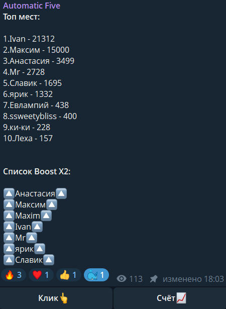

# 🎮 Clicker Game Bot — Telegram-бот-кликер для каналов и чатов

Добро пожаловать в **Clicker Game Bot** — это полностью настраиваемый Telegram-бот с механикой кликов, системой очков, рейтингом топ-игроков и X2-бустами.  
Бот создаёт весёлую мини-игру прямо в вашем канале или чате и повышает вовлечённость аудитории.

> 🛠 Разработан для Telegram-канала **Automatic Five**, но легко адаптируется под любые другие проекты.  
> 🔓 Распространяется под лицензией [GNU AGPL v3.0](LICENSE).

---

## Пример использования


---

## 🚀 Преимущества

- **Интерактив** — пользователи нажимают кнопку "Клик", соревнуясь за первое место.
- **Система X2 Boost** — возможность временно удвоить очки конкретным участникам.
- **Топ-10 игроков** — автоматически обновляемый лидерборд.
- **Хранение данных** — баллы и бусты сохраняются между сессиями в JSON-файлах.
- **Лёгкий запуск** — всё на Python, без базы данных.
- **Гибкость и открытость** — вы можете адаптировать игру под свои правила.

---

## 🧩 Структура проекта

```
.
├── .gitignore                # Исключения для git
├── LICENSE                   # GNU Affero General Public License
├── sample\sample.png"        # Пример использования бота
├── README.md                 # Этот файл
├── requirements.txt          # Необходимые зависимости Python
├── logger.py                 # Настройка логирования в файл
├── loaders.py                # Загрузка и сохранение JSON-данных
├── main.py                   # Основная логика бота
└── JSONs/
    ├── boosterX2.json        # Список пользователей с активным бустом
    └── score.json            # Таблица баллов игроков
```

---

## ⚙️ Установка и запуск

> 💡 Бот написан на Python 3.10+. Убедитесь, что у вас установлена актуальная версия Python.

1. **Клонируйте репозиторий:**

```bash
git clone https://github.com/your_username/clicker-game-bot.git
cd clicker-game-bot
```

2. **Создайте виртуальное окружение и установите зависимости:**
```bash
python -m venv venv
source venv/bin/activate  # Для Linux/Mac
venv\Scripts\activate     # Для Windows
```
```bash
pip install -r requirements.txt # (может потребоваться обновление библиотек)
```
или
```bash
pip install pyTelegramBotAPI python-dotenv
```

3. **Создайте `.env` файл** в корне проекта и добавьте туда переменные:

```
BOT_TOKEN=ваш_токен_бота
ADMIN_ID=ваш_telegram_id
PLAYER_ID=telegram_id_игрока (или канала)
```

4. **Запустите бота:**

```bash
python main.py
```

---

## ⚠️ Важно: как избежать повторной отправки сообщения

Если вы перезапускаете бота, сообщение с кнопками **«Клик» / «Счёт»** может быть отправлено повторно.  
Чтобы избежать этого:

### 🔧 В файле `main.py` закомментируйте следующую строку:
```python
bot.send_message(chat_id=player_id, text="Нажми, чтобы играть «Клик»", reply_markup=lottery_markup)
```

Это нужно сделать **после первого запуска**, чтобы бот не отправлял дублирующее сообщение при каждой перезагрузке.

---

## 🔍 Подходит для:

- Развлекательных Telegram-каналов
- Промо-игр и розыгрышей
- Сообществ, где хочется добавить элемент геймификации
- Частных чатов с друзьями

---

## 📄 Лицензия

Проект распространяется под лицензией [GNU Affero General Public License v3.0](https://www.gnu.org/licenses/agpl-3.0.html).  
Вы можете свободно использовать, модифицировать и распространять этот код, соблюдая условия лицензии.

---

## 🤝 Благодарности

Спасибо всем, кто тестировал, играл и давал фидбек. Этот бот — часть экспериментов в автоматизации взаимодействия в Telegram.

Если вы хотите адаптировать этот проект под себя, не стесняйтесь — **форкайте и настраивайте!**

---

**Clicker Game Bot** — игра, которая оживляет ваш Telegram 🌟

Разработано с ❤️ на Python, чтобы сделать вашу жизнь веселее.